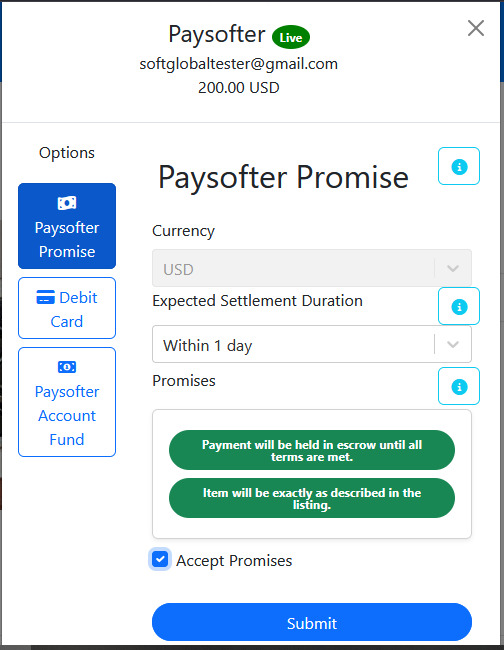

<!-- README.md -->

# React Paysofter

This is a ReactJS package for integrating Paysofter payment gateway into your ReactJS application.





## Installation

To install the package, run:

```bash
npm install react-paysofter
```

## Usage

Here are basic examples of how to use the `react-paysofter` library in your ReactJS project.


<!--  -->
<!--  -->

### Example 1: Basic Payment Setup

```jsx
import React from "react";
import { Paysofter } from "react-paysofter";

const App = () => {
  const amount = 10; // Amount in dollars, e.g., 10.00 USD
  const [paysofterPublicKey] = useState("test_api_key_abc123"); // Replace with your actual Paysofter public key

  const handleOnSuccess = () => {
    console.log("Payment successful!");
  };

  const handleOnClose = () => {
    console.log("Payment window closed.");
  };

  return (
    <Paysofter
      amount={amount}
      currency="USD"
      email="user@example.com"
      paysofterPublicKey={paysofterPublicKey}
      onSuccess={handleOnSuccess}
      onClose={handleOnClose}
      paymentRef={`PID${Math.floor(Math.random() * 100000000000000)}`}
      showPromiseOption={true}
      showFundOption={false}
      showCardOption={true}
    />
  );
};

export default App;
```

### Example 2: Payment Setup with "Pay Now" Button Option

```jsx
import React, { useState } from "react";
import { Paysofter } from "react-paysofter";

const App = () => {
  const [showPayment, setShowPayment] = useState(false);
  const amount = 5000; // Amount in Nigerian Naira, e.g., NGN 5,000
  const currency = "NGN"; // Nigerian Naira
  const email = "buyer@example.com"; // Buyer's email
  const [paysofterPublicKey] = useState("test_api_key_abc123"); // Replace with your actual Paysofter public key

  const handleOnSuccess = () => {
    console.log("Payment successful!");
    setShowPayment(false); // Hide payment component after success
  };

  const handleOnClose = () => {
    console.log("Payment window closed.");
    setShowPayment(false); // Hide payment component when closed
  };

  return (
    <div>
      {!showPayment ? (
        <button onClick={() => setShowPayment(true)}>Pay Now</button>
      ) : (
        <Paysofter
          amount={amount}
          currency={currency}
          email={email}
          paysofterPublicKey={paysofterPublicKey}
          onSuccess={handleOnSuccess}
          onClose={handleOnClose}
          paymentRef={`PID${Math.floor(Math.random() * 100000000000000)}`}
          showPromiseOption={truefalse}
          showFundOption={false}
          showCardOption={false}
        />
      )}
    </div>
  );
};

export default App;
```

### Example 3: Payment Setup with "Pay Now" Button Option and Input Fields

```jsx
import React, { useState } from "react";
import { Form, Button } from "react-bootstrap";
import 'bootstrap/dist/css/bootstrap.min.css'; // Add bootstrap.min.css to the entry point of your app e.g. "index.js" to be available globally
import { Paysofter } from "react-paysofter";

const App = () => {
  const [showPayment, setShowPayment] = useState(false);
  const [amount, setAmount] = useState(5000); // Default amount in NGN, e.g., NGN 5,000
  const [currency, setCurrency] = useState("NGN"); // Default currency
  const [email, setEmail] = useState("buyer@example.com"); // Default email
  const [paysofterPublicKey] = useState("test_api_key_abc123"); // Replace with your actual Paysofter public key
  // const paymentRef = `PID${Math.floor(Math.random() * 10000000000000000)}`; // Generate a 17-digit random payment reference with PID prefix
  const paymentRef = `PID${new Date()
    .toISOString()
    .slice(2, 19)
    .replace(/[-T:]/g, "")}${Math.floor(Math.random() * 100000)}`; // Or generate a 17-digit payment reference with PID prefix starting with the timestamp and random numbers appended at the end as in 'PIDYYMMDDHHMMSSxxxxx'.
  console.log("paymentRef:", paymentRef);

  const handleOnSuccess = () => {
    console.log("Payment successful!");
    setShowPayment(false); // Hide payment component after success
  };

  const handleOnClose = () => {
    console.log("Payment window closed.");
    setShowPayment(false); // Hide payment component when closed
  };

  return (
    <div
      style={{
        display: "flex",
        flexDirection: "column",
        alignItems: "center",
        justifyContent: "center",
        padding: "20px",
        minHeight: "100vh",
      }}
    >
      <h2 style={{ textAlign: "center", padding: "10px" }}>Checkout</h2>
      {!showPayment ? (
        <Form>
          <Form.Group controlId="formAmount">
            <Form.Label>Amount: </Form.Label>
            <Form.Control
              type="number"
              placeholder="Enter Amount"
              value={amount}
              onChange={(e) => setAmount(Number(e.target.value))}
            />
          </Form.Group>

          <Form.Group controlId="formCurrency" style={{ marginTop: "10px" }}>
            <Form.Label>Currency: </Form.Label>
            <Form.Control
              type="text"
              placeholder="Enter Currency"
              value={currency}
              onChange={(e) => setCurrency(e.target.value)}
            />
          </Form.Group>

          <Form.Group controlId="formEmail" style={{ marginTop: "10px" }}>
            <Form.Label>Email: </Form.Label>
            <Form.Control
              type="email"
              placeholder="Enter Email"
              value={email}
              onChange={(e) => setEmail(e.target.value)}
            />
          </Form.Group>

          <div
            style={{
              display: "flex",
              justifyContent: "center",
              padding: "10px",
            }}
          >
            <Button
              variant="primary"
              onClick={() => setShowPayment(true)}
              style={{ marginTop: "20px" }}
            >
              Pay Now
            </Button>
          </div>
        </Form>
      ) : (
        <>
           <Paysofter
            amount={amount}
            currency={currency}
            email={email}
            paysofterPublicKey={paysofterPublicKey}
            onSuccess={handleOnSuccess}
            onClose={handleOnClose}
            paymentRef={paymentRef}
            showPromiseOption={false}
            showFundOption={true}
            showCardOption={true}
          /> 
        </>
      )}
    </div>
  );
};

export default App;
```

## Props

| Prop Name            | Type     | Description                                                                                                                                                                                                                                                                                                                                              |
| :------------------- | :------- | :------------------------------------------------------------------------------------------------------------------------------------------------------------------------------------------------------------------------------------------------------------------------------------------------------------------------------------------------------- |
| `amount`             | Number   | The amount to be paid.                                                                                                                                                                                                                                                                                                                                   |
| `currency`           | String   | The currency in which the payment is to be made (e.g., USD, NGN).                                                                                                                                                                                                                                                                                        |
| `email`              | String   | The email address of the user making the payment.                                                                                                                                                                                                                                                                                                        |
| `paysofterPublicKey` | String   | Your Paysofter public key for processing the payment.                                                                                                                                                                                                                                                                                                    |
| `onSuccess`          | Function | Callback function to handle the success of the payment.                                                                                                                                                                                                                                                                                                  |
| `onClose`            | Function | Callback function to handle the closing of the payment window.                                                                                                                                                                                                                                                                                           |
| `paymentRef`         | String   | A unique identifier for the payment serving as a refrence. Either generate a 17-digit random payment reference with PID prefix, or generate a 17-digit payment reference with PID prefix starting with a timestamp and a small random number appended at the end. Paysofter also generates a tarnsaction ID(TID) to reference every payment tarnsaction. |
| `showPromiseOption`  | Boolean  | Whether to show the Promise payment option (default: true). If all options are delcared false then Promise payment option defaults to true.                                                                                                                                                                                                              |
| `showFundOption`     | Boolean  | Whether to show the Fund Account payment option.                                                                                                                                                                                                                                                                                                         |
| `showCardOption`     | Boolean  | Whether to show the Card payment option.                                                                                                                                                                                                                                                                                                                 |

## Contributing to the Project

1. **Fork the Repository:** Begin by forking the repository to your GitHub account.
2. **Create a New Feature Branch:** Create a branch for your feature or bug fix using the following command:
   ```bash
   git checkout -b feature-name
   ```
3. **Commit Your Changes:** Once you’ve made your changes, commit them with a meaningful message:
   ```bash
   git commit -am 'Description of the changes made'
   ```
4. **Push to the Branch:** Push your feature branch to the repository:
   ```bash
   git push origin feature-name
   ```
5. **Submit a Pull Request:** Finally, submit a pull request for review and integration.

## Additional Configuration Options

For further configuration options, please refer to the [Paysofter Documentation](https://paysofter.com/docs/).
